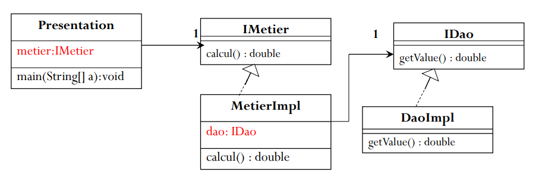
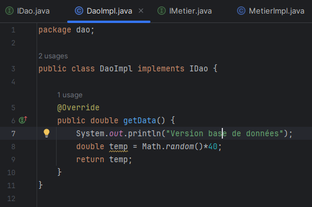
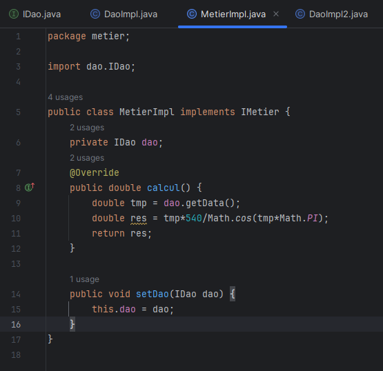
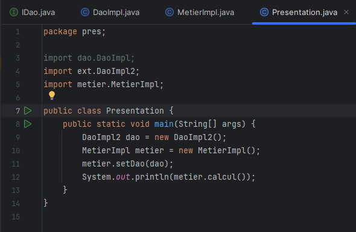
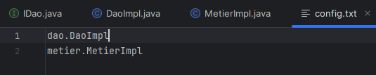
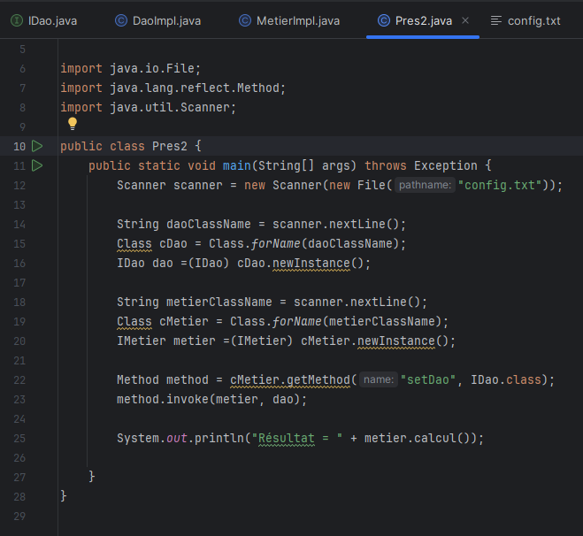

<h3>Activité Pratique N°1</h3>

On considère le diagramme suivant : 

1. Créer l'interface IDao avec une méthode getDate :

2. Créer une implémentation de cette interface :

3. Créer l'interface IMetier avec une méthode calcul :

4. Créer une implémentation de cette interface en utilisant le couplage faible :

5. Faire l'injection des dépendances : -Par Instancation Statique :

5. -Par Instanciation Dynamique :

c

